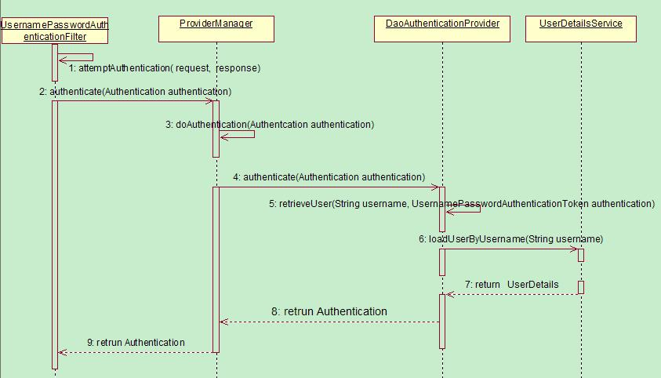

项目需要用到，结合一位大佬[徐靖峰](https://www.cnkirito.moe/tags/Spring-Security/)的笔记学习

# 基础架构认识

## 核心组件

1. SecurityContextHolder

   存储安全上下文，当前用户是谁，是否已经被认证，有哪些权限……

   ThreadLocal存储

   ```java
   // 获取用户名
   Object principal = SecurityContextHolder.getContext().getAuthentication().getPrincipal();
   
   if (principal instanceof UserDetails) {
   String username = ((UserDetails)principal).getUsername();
   } else {
   String username = principal.toString();
   }
   ```

2. Authentication

   可以得到用户拥有的权限信息列表，密码，用户细节信息，用户身份信息，认证信息。

   - getAuthorities（），权限信息列表，默认是GrantedAuthority接口的一些实现类，通常是代表权限信息的一系列字符串。
   - getCredentials（），密码信息，用户输入的密码字符串，在认证过后通常会被移除，用于保障安全。
   - getDetails（），细节信息，web应用中的实现接口通常为WebAuthenticationDetails，.它记录了访问者的ip地址和sessionld的值。
   - getPrincipal（）最重要的身份信息，大部分情况下返回的是UserDetails接口的实现类，也是框架中的常用接口之一。

3. AuthenticationManager

   发起认证的出发点

   AuthenticationManager 一般不直接认证，AuthenticationManager 接口的常用实现类 `ProviderManager` 内部会维护一个 `List<AuthenticationProvider>` 列表，存放多种认证方式，实际上这是委托者模式的应用（Delegate）

   核心的认证入口始终只有一个：AuthenticationManager。不同的认证方式：用户名 + 密码（UsernamePasswordAuthenticationToken），邮箱 + 密码，手机号码 + 密码登录则对应了三个 AuthenticationProvider

   可以把 AuthenticationProvider 理解成 Shiro的Realm

   

   > 身份信息的存放容器 SecurityContextHolder，身份信息的抽象 Authentication，身份认证器 AuthenticationManager 及其认证流程。

4. DaoAuthenticationProvider

   它获取用户提交的用户名和密码，比对其正确性，如果正确，返回一个数据库中的用户信息（假设用户信息被保存在数据库中）。

5. UserDetails、UserDetailsService

   - Authentication 的 getCredentials()与 UserDetails 中的 getPassword() 需要被区分对待，前者是用户提交的密码凭证，后者是用户正确的密码，认证器其实就是对这两者的比对。

     Authentication 中的 getAuthorities()实际是由 UserDetails 的 getAuthorities() 传递而形成的。

   - UserDetailsService 只负责从特定的地方（通常是数据库）加载用户信息，仅此而已

     UserDetailsService 常见的实现类有 JdbcDaoImpl，InMemoryUserDetailsManager，前者从数据库加载用户，后者从内存中加载用户，也可以自己实现 UserDetailsService，通常这更加灵活。


## 认证流程

1. 用户名、密码被过滤器获取，封装成Authentication，通常是UsernamePasswordAuthenticationToken
2. AuthenticationManager管理Authentication
3. 认证成功，AuthenticationManager返回一个填满信息的Authentication
4. SecurityContextHolder将第 3 步填充了信息的 `Authentication`，通过 SecurityContextHolder.getContext().setAuthentication(…) 方法，设置到其中。


# 开始 Demo01

1. 添加依赖

   ```xml
   <dependency>
     <groupId>org.springframework.boot</groupId>
     <artifactId>spring-boot-starter-web</artifactId>
   </dependency>
   <dependency>
     <groupId>org.springframework.boot</groupId>
     <artifactId>spring-boot-starter-security</artifactId>
   </dependency>
   <dependency>
     <groupId>org.springframework.boot</groupId>
     <artifactId>spring-boot-starter-thymeleaf</artifactId>
   </dependency>
   ```

2. 在resources/templates中创建html页面

   home.html

   ```html
   <!DOCTYPE html>
   <html xmlns="http://www.w3.org/1999/xhtml" xmlns:th="http://www.thymeleaf.org" xmlns:sec="http://www.thymeleaf.org/thymeleaf-extras-springsecurity3">
   <head>
     <title>Spring Security Example</title>
   </head>
   <body>
   <h1>Welcome!</h1>
   
   <p>Click <a th:href="@{/hello}">here</a> to see a greeting.</p>
   </body>
   </html>
   ```

   hello.html

   ```html
   <!DOCTYPE html>
   <html xmlns="http://www.w3.org/1999/xhtml" xmlns:th="http://www.thymeleaf.org"
         xmlns:sec="http://www.thymeleaf.org/thymeleaf-extras-springsecurity3">
   <head>
     <title>Hello World!</title>
   </head>
   <body>
   <h1 th:inline="text">Hello [[${#httpServletRequest.remoteUser}]]!</h1>
   <form th:action="@{/logout}" method="post">
     <input type="submit" value="Sign Out"/>
   </form>
   </body>
   </html>
   ```

   login.html

   ```html
   <!DOCTYPE html>
   <html xmlns="http://www.w3.org/1999/xhtml" xmlns:th="http://www.thymeleaf.org"
         xmlns:sec="http://www.thymeleaf.org/thymeleaf-extras-springsecurity3">
   <head>
     <title>Spring Security Example </title>
   </head>
   <body>
   <div th:if="${param.error}">
     Invalid username and password.
   </div>
   <div th:if="${param.logout}">
     You have been logged out.
   </div>
   <form th:action="@{/login}" method="post">
     <div><label> User Name : <input type="text" name="username"/> </label></div>
     <div><label> Password: <input type="password" name="password"/> </label></div>
     <div><input type="submit" value="Sign In"/></div>
   </form>
   </body>
   </html>
   ```

3. 配置MVC

   ```java
   package com.zhj6422.springsecuritytest.config;
   
   import org.springframework.context.annotation.Configuration;
   import org.springframework.web.servlet.config.annotation.ViewControllerRegistry;
   import org.springframework.web.servlet.config.annotation.WebMvcConfigurer;
   
   @Configuration
   public class MvcConfig implements WebMvcConfigurer {
   
     @Override
     public void addViewControllers(ViewControllerRegistry registry) {
       registry.addViewController("/home").setViewName("home");
       registry.addViewController("/").setViewName("home");
       registry.addViewController("/hello").setViewName("hello");
       registry.addViewController("/login").setViewName("login");
     }
   }
   ```

4. 配置Security

   ```java
   package com.zhj6422.springsecuritytest.config;
   
   import org.springframework.context.annotation.Bean;
   import org.springframework.context.annotation.Configuration;
   import org.springframework.security.config.annotation.web.builders.HttpSecurity;
   import org.springframework.security.config.annotation.web.configuration.EnableWebSecurity;
   import org.springframework.security.config.annotation.web.configuration.WebSecurityConfigurerAdapter;
   import org.springframework.security.core.userdetails.User;
   import org.springframework.security.core.userdetails.UserDetails;
   import org.springframework.security.core.userdetails.UserDetailsService;
   import org.springframework.security.provisioning.InMemoryUserDetailsManager;
   
   /*
   * EnableWebSecurity注解使SpringMVC继承了web安全支持
   * */
   @Configuration
   @EnableWebSecurity
   public class WebSecurityConfig extends WebSecurityConfigurerAdapter {
     /*
     * 定义哪些url要被拦截
     * */
     @Override
     protected void configure(HttpSecurity http) throws Exception {
       http
           .authorizeRequests()
           .antMatchers("/", "/home").permitAll() // 除了/ 和/home，其他都要认证
           .anyRequest().authenticated()
           .and()
           .formLogin()
           .loginPage("/login") // 指定login为登录页面，尝试访问受保护资源时，都跳转到/login
           .permitAll()
           .and()
           .logout()
           .permitAll();
     }
   
     /*
     * 内存中生成一个用户
     * */
     @Bean
     @Override
     public UserDetailsService userDetailsService() {
       UserDetails user =
           User.withDefaultPasswordEncoder()
               .username("user")
               .password("password")
               .roles("USER")
               .build();
   
       return new InMemoryUserDetailsManager(user);
     }
   }
   ```

5. 启动类

   ```java
   package com.zhj6422.springsecuritytest;
   
   import org.springframework.boot.SpringApplication;
   import org.springframework.boot.autoconfigure.SpringBootApplication;
   
   @SpringBootApplication
   public class SpringSecurityTestApplication {
     public static void main(String[] args) throws Throwable{
       SpringApplication.run(SpringSecurityTestApplication.class, args);
     }
   }
   ```

   开启，测试


# 核心配置

## @EnableWebSecurity

- 加载了 WebSecurityConfiguration，AuthenticationConfiguration 这两个核心配置类，也就此将 spring security 的职责划分为了配置安全信息，配置认证信息两部分。

- WebSecurityConfiguration

  注册了一个重要的Bean

  ```java
  //DEFAULT_FILTER_NAME = "springSecurityFilterChain"
  @Bean(name = AbstractSecurityWebApplicationInitializer.DEFAULT_FILTER_NAME)
  public Filter springSecurityFilterChain() throws Exception {
    ...
  }
  ```

  WebSecurityConfiguration 中完成了声明 springSecurityFilterChain 的作用，并且最终交给 DelegatingFilterProxy 这个代理类，负责拦截请求

- AuthenticationConfiguration

  负责生成全局的身份认证管理者 AuthenticationManager


## WebSecurityConfigurerAdapter

- HttpSecurity

  每一个 and()对应了一个模块的配置（等同于 xml 配置中的结束标签），并且 and() 返回了 HttpSecurity 本身，于是可以连续进行配置。

  - authorizeRequests() 配置路径拦截，表明路径访问所对应的权限，角色，认证信息。
  - formLogin() 对应表单认证相关的配置
  - logout() 对应了注销相关的配置
  - httpBasic() 可以配置 basic 登录

- WebSecurity

- AuthenticationManagerBuilder 

  暴露一个 AuthenticationManager 的建造器

  可以配置内存用户


# 过滤器

1. **SecurityContextPersistenceFilter**

   - 请求来临时，创建 `SecurityContext` 安全上下文信息
   - 请求结束时清空 `SecurityContextHolder`

   存储安全上下文和读取安全上下文的工作完全委托给了 HttpSessionSecurityContextRepository 去处理

2. HeaderWriterFilter

   用来给 http 响应添加一些 Header

3. CsrfFilter

   防止 csrf 攻击

4. LogoutFilter

   处理注销的过滤器

5. **UsernamePasswordAuthenticationFilter**

   表单提交了 username 和 password，被封装成 token 进行一系列的认证，便是主要通过这个过滤器完成的

   完成用户的认证，父类为AbstractAuthenticationProcessingFilter

6. RequestCacheAwareFilter

   内部维护了一个 RequestCache，用于缓存 request 请求

7. SecurityContextHolderAwareRequestFilter

   对 ServletRequest 进行了一次包装，使得 request 具有更加丰富的 API

8. **AnonymousAuthenticationFilter**

   spring security 为了兼容未登录的访问，也走了一套认证流程，只不过是一个匿名的身份。

   位于UsernamePasswordAuthenticationFilter之后，如果SecurityContext还是没有用户信息，就新增一个匿名用户

9. SessionManagementFilter

   和 session 相关的过滤器，内部维护了一个 SessionAuthenticationStrategy，两者组合使用，常用来防止 `session-fixation protection attack`，以及限制同一用户开启多个会话的数量

10. **ExceptionTranslationFilter**

    本身不处理异常，而是将认证过程中出现的异常交给内部维护的一些类去处理

    - AccessDeniedException 访问异常

    - AuthenticationException 认证异常

11. **FilterSecurityInterceptor**

    决定了访问特定路径应该具备的权限，访问的用户的角色，权限是什么？访问的路径需要什么样的角色和权限？这些判断和处理都是由该类进行的。

    FilterSecurityInterceptor 从 SecurityContextHolder 中获取 Authentication 对象，然后比对用户拥有的权限和资源所需的权限


# IP_Login Demo02



1. IpAuthenticationProcessingFilter 代替 UsernamePasswordAuthenticationFilter
2. IpAuthenticationToken 代替 UsernamePasswordAuthenticationToken
3. ProviderManager 不变
4. IpAuthenticationProvider 代替 DaoAuthenticationProvider
5. ConcurrentHashMap 代替 UserDetailsService


## IpAuthenticationToken

模仿UsernamePasswordAuthenticationFilter写法

```java
package com.zhj6422.springsecuritytest.entity;

import java.util.Collection;
import org.springframework.security.authentication.AbstractAuthenticationToken;
import org.springframework.security.core.GrantedAuthority;

public class IpAuthenticationToken extends AbstractAuthenticationToken {

  private String ip;

  public String getIp() {
    return ip;
  }

  public void setIp(String ip) {
    this.ip = ip;
  }

  public IpAuthenticationToken(String ip) {
    super(null);
    this.ip = ip;
    super.setAuthenticated(false);// 注意这个构造方法是认证时使用的
  }

  public IpAuthenticationToken(String ip, Collection<? extends GrantedAuthority> authorities) {
    super(authorities);
    this.ip = ip;
    super.setAuthenticated(true);// 注意这个构造方法是认证成功后使用的

  }

  @Override
  public Object getCredentials() {
    return null;
  }

  @Override
  public Object getPrincipal() {
    return this.ip;
  }
}
```

两个构造方法，一个是认证前传给认证器用的，另一个是认证成功后使用的。


## IpAuthenticationProcessingFilter

```java
package com.zhj6422.springsecuritytest.filter;

import com.zhj6422.springsecuritytest.entity.IpAuthenticationToken;
import java.io.IOException;
import javax.servlet.ServletException;
import javax.servlet.http.HttpServletRequest;
import javax.servlet.http.HttpServletResponse;
import org.springframework.security.core.Authentication;
import org.springframework.security.core.AuthenticationException;
import org.springframework.security.web.authentication.AbstractAuthenticationProcessingFilter;
import org.springframework.security.web.util.matcher.AntPathRequestMatcher;

public class IpAuthenticationProcessingFilter extends AbstractAuthenticationProcessingFilter {
  // 使用 /ipVerify 该端点进行 ip 认证
  public IpAuthenticationProcessingFilter() {
    super(new AntPathRequestMatcher("/ipVerify"));
  }

  @Override
  public Authentication attemptAuthentication(HttpServletRequest request, HttpServletResponse response) throws AuthenticationException, IOException, ServletException {
    // 获取 host 信息
    String host = request.getRemoteHost();
    // 交给内部的 AuthenticationManager 去认证，实现解耦
    return getAuthenticationManager().authenticate(new IpAuthenticationToken(host));
  }
}

```


## IpAuthenticationProvider

维护一个ip白名单，如果请求的是白名单中的ip，则返回一个通过认证的token，如果没有则返回null

```java
package com.zhj6422.springsecuritytest.provider;

import com.zhj6422.springsecuritytest.entity.IpAuthenticationToken;
import java.util.Arrays;
import java.util.Map;
import java.util.concurrent.ConcurrentHashMap;
import org.springframework.security.authentication.AuthenticationProvider;
import org.springframework.security.core.Authentication;
import org.springframework.security.core.AuthenticationException;
import org.springframework.security.core.authority.SimpleGrantedAuthority;

public class IpAuthenticationProvider implements AuthenticationProvider {
  final static Map<String, SimpleGrantedAuthority> ipAuthorityMap = new ConcurrentHashMap();
  // 维护一个 ip 白名单列表，每个 ip 对应一定的权限
  static {
    ipAuthorityMap.put("127.0.0.1", new SimpleGrantedAuthority("ADMIN"));
    ipAuthorityMap.put("10.236.69.103", new SimpleGrantedAuthority("ADMIN"));
    ipAuthorityMap.put("10.236.69.104", new SimpleGrantedAuthority("FRIEND"));
  }

  @Override
  public Authentication authenticate(Authentication authentication) throws AuthenticationException {
    IpAuthenticationToken ipAuthenticationToken = (IpAuthenticationToken) authentication;
    String ip = ipAuthenticationToken.getIp();
    SimpleGrantedAuthority simpleGrantedAuthority = ipAuthorityMap.get(ip);
    // 不在白名单列表中
    if (simpleGrantedAuthority == null) {
      return null;
    } else {
      // 封装权限信息，并且此时身份已经被认证
      return new IpAuthenticationToken(ip, Arrays.asList(simpleGrantedAuthority));
    }
  }

  // 只支持 IpAuthenticationToken 该身份
  @Override
  public boolean supports(Class<?> authentication) {
    return (IpAuthenticationToken.class
        .isAssignableFrom(authentication));
  }
}
```


## 修改WebSecurityConfig

```java
package com.zhj6422.springsecuritytest.config;

import com.zhj6422.springsecuritytest.filter.IpAuthenticationProcessingFilter;
import com.zhj6422.springsecuritytest.provider.IpAuthenticationProvider;
import org.springframework.context.annotation.Bean;
import org.springframework.context.annotation.Configuration;
import org.springframework.security.authentication.AuthenticationManager;
import org.springframework.security.config.annotation.authentication.builders.AuthenticationManagerBuilder;
import org.springframework.security.config.annotation.web.builders.HttpSecurity;
import org.springframework.security.config.annotation.web.configuration.EnableWebSecurity;
import org.springframework.security.config.annotation.web.configuration.WebSecurityConfigurerAdapter;
import org.springframework.security.core.userdetails.User;
import org.springframework.security.core.userdetails.UserDetails;
import org.springframework.security.core.userdetails.UserDetailsService;
import org.springframework.security.provisioning.InMemoryUserDetailsManager;
import org.springframework.security.web.authentication.LoginUrlAuthenticationEntryPoint;
import org.springframework.security.web.authentication.SimpleUrlAuthenticationFailureHandler;
import org.springframework.security.web.authentication.UsernamePasswordAuthenticationFilter;

/*
* EnableWebSecurity注解使SpringMVC继承了web安全支持
* */
@Configuration
@EnableWebSecurity
public class WebSecurityConfig extends WebSecurityConfigurerAdapter {

  //ip 认证者配置
  @Bean
  IpAuthenticationProvider ipAuthenticationProvider() {
    return new IpAuthenticationProvider();
  }

  // 配置封装 ipAuthenticationToken 的过滤器
  IpAuthenticationProcessingFilter ipAuthenticationProcessingFilter(
      AuthenticationManager authenticationManager) {
    IpAuthenticationProcessingFilter ipAuthenticationProcessingFilter = new IpAuthenticationProcessingFilter();
    // 为过滤器添加认证器
    ipAuthenticationProcessingFilter.setAuthenticationManager(authenticationManager);
    // 重写认证失败时的跳转页面
    ipAuthenticationProcessingFilter.setAuthenticationFailureHandler(new SimpleUrlAuthenticationFailureHandler("/ipLogin?error"));
    return ipAuthenticationProcessingFilter;
  }

  // 配置登录端点
  @Bean
  LoginUrlAuthenticationEntryPoint loginUrlAuthenticationEntryPoint(){
    LoginUrlAuthenticationEntryPoint loginUrlAuthenticationEntryPoint = new LoginUrlAuthenticationEntryPoint
        ("/ipLogin");
    return loginUrlAuthenticationEntryPoint;
  }

  @Override
  protected void configure(HttpSecurity http) throws Exception {
    http
        .authorizeRequests()
        .antMatchers("/", "/home").permitAll()
        .antMatchers("/ipLogin").permitAll()
        .anyRequest().authenticated()
        .and()
        .logout()
        .logoutSuccessUrl("/")
        .permitAll()
        .and()
        .exceptionHandling()
        .accessDeniedPage("/ipLogin")
        .authenticationEntryPoint(loginUrlAuthenticationEntryPoint())
    ;

    // 注册 IpAuthenticationProcessingFilter  注意放置的顺序 这很关键
    http.addFilterBefore(ipAuthenticationProcessingFilter(authenticationManager()), UsernamePasswordAuthenticationFilter.class);

  }

  @Override
  protected void configure(AuthenticationManagerBuilder auth) throws Exception {
    // 添加自定义的ipAuthenticationProvider
    auth.authenticationProvider(ipAuthenticationProvider());
  }
}
```


## 修改MvcConfig

```java
package com.zhj6422.springsecuritytest.config;

import org.springframework.context.annotation.Configuration;
import org.springframework.web.servlet.config.annotation.ViewControllerRegistry;
import org.springframework.web.servlet.config.annotation.WebMvcConfigurer;

@Configuration
public class MvcConfig implements WebMvcConfigurer {

  @Override
  public void addViewControllers(ViewControllerRegistry registry) {
    registry.addViewController("/home").setViewName("home");
    registry.addViewController("/").setViewName("home");
    registry.addViewController("/hello").setViewName("hello");
    registry.addViewController("/ip").setViewName("ipHello");
    registry.addViewController("/ipLogin").setViewName("ipLogin");
  }
}

```


## 添加html页面

ipHello.html

```html
<!DOCTYPE html>
<html xmlns="http://www.w3.org/1999/xhtml" xmlns:th="http://www.thymeleaf.org"
      xmlns:sec="http://www.thymeleaf.org/thymeleaf-extras-springsecurity3">
<head>
  <title>Hello World!</title>
</head>
<body>
<h1 th:inline="text">Hello IP [[${#httpServletRequest.remoteUser}]]!</h1>

</body>
</html>
```

ipLogin.html

```html
<!DOCTYPE html>
<html xmlns="http://www.w3.org/1999/xhtml" xmlns:th="http://www.thymeleaf.org">
<head>
  <title>IP Login Example!</title>
</head>
<body>
<div th:if="${param.error}">
  Invalid IP.
</div>
<div th:if="${param.logout}">
  You have been logged out.
</div>
<form th:action="@{/ipVerify}" method="post">
  <div><input type="submit" value="Sign In by IP"/></div>
</form>
</body>
</html>
```


# SpringSecurityFilterChain 加载流程

org.springframework.web.filter.DelegatingFilterProxy

org.springframework.security.web.FilterChainProxy

org.springframework.security.web.SecurityFilterChain

## DelegatingFilterProxy

DelegatingFilterProxy 的逻辑就是为了调用 `private volatile Filter delegate;`

DelegatingFilterProxy 尝试去容器中获取名为 targetBeanName 的类，而 targetBeanName 的默认值便是 Filter 的名称，也就是 springSecurityFilterChain！也就是说，DelegatingFilterProxy 只是名称和 targetBeanName 叫 springSecurityFilterChain，真正容器中的 Bean(name=”springSecurityFilterChain”) 其实另有其人


## FilterChainProxy 和 SecurityFilterChain

- FilterChainProxy

  FilterChainProxy才是真正的 springSecurityFilterChain

  内部维护了一个 SecurityFilterChain，这个过滤器链才是请求真正对应的过滤器链

  可能同时存在多个安全过滤器链

  每个 request 最多只会经过一个 SecurityFilterChain

- SecurityFilterChain

  SecurityFilterChain 才是真正意义上的 SpringSecurityFilterChain


## SecurityFilterChain 的注册过程

@EnableWebSecurity和WebSecurityConfigurerAdapter配置，最终追溯到WebSecurity中的performBuild方法，封装


